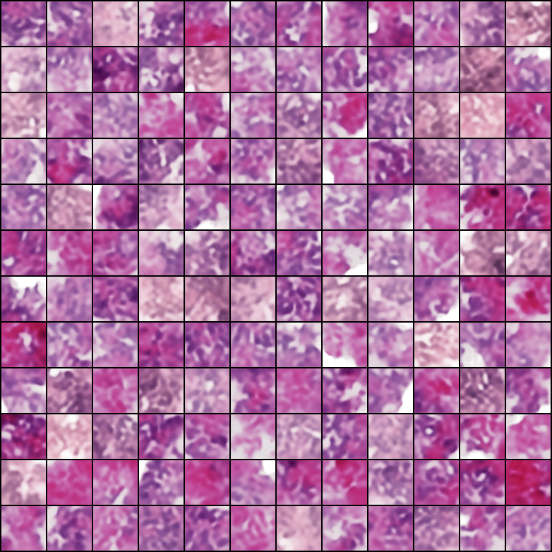
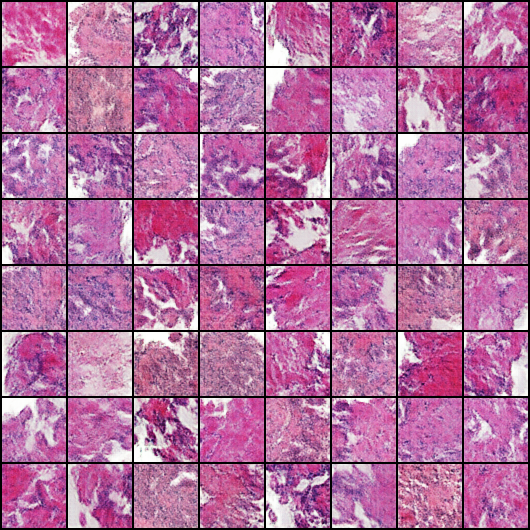

# VAE for Medical Images

## CS 675 / ECE 685 Final Project

### Authors
- Maximilian Holsman
- Teo Feliu
- Emmanuel Mokel

### Abstract
Variational Autoencoders (VAEs) are powerful deep generative models designed to produce realistic synthetic data. In medical contexts, where data collection is often challenging and costly, VAEs offer a promising solution to enhance the quality of medical image datasets. This project explores the use of various VAE variants to generate synthetic images from medical datasets and aims to improve the realism of these images by training a generator to distinguish synthetic data from actual medical images, mirroring Generative Adversarial Network (GAN) techniques. Our goal is to demonstrate the potential of VAEs in generating synthetic medical images for practical applications and dataset enhancement.

### 1. VAE Introduction
VAEs have revolutionized generative machine models, finding applications across image generation, anomaly detection, and even drug discovery. By capturing data in a lower-dimensional latent space, VAEs offer a probabilistic approach to data generation, overcoming the computational challenges of traditional methods. The success of VAEs since their introduction highlights their versatility and the ongoing innovation in developing new variants.

#### 1.1 Medical Applications
VAEs hold particular promise in the medical field for generating synthetic data and denoising images, addressing the scarcity of quality datasets in certain medical areas. This capability is crucial for developing predictive models that can augment medical professionals' expertise.

### 2. Medical Datasets
Our study utilizes three distinct medical datasets to evaluate the effectiveness of VAEs in generating medical images:
- **Prostate Gleason**: A collection of prostate cancer biopsy images classified by Gleason Score.
- **ChestMNIST**: Chest X-ray samples in a format similar to the MNIST dataset.
- **RetinaMNIST**: Images of retinas captured with a Fundus Camera.

#### Figures for Datasets
- **Figure 1**: Snapshot of the Prostate Gleason Dataset.
  

- **Figure 2**: Snapshot of the ChestMNIST Dataset.
  

- **Figure 3**: Snapshot of the RetinaMNIST Dataset.
  

### 3. VAE Variants for Medical Image Generation
We explored several VAE variants to optimize synthetic image generation, utilizing Google Colab and T4 GPUs for our experiments.

#### 3.1 Vanilla VAE
Our initial approach with a Vanilla VAE revealed limitations in image quality, prompting further exploration of hyperparameters and dataset suitability.

#### 3.2 MSSIM VAE
Adopting the Multiscale Structural Similarity Score (MS-SSIM) as a loss metric, we adjusted our VAE to better capture human perceptual judgments, significantly improving image quality.

#### 3.3 VAE-GAN
Combining VAE with GAN architectures, we achieved high-quality image reconstruction and generation, demonstrating the potential for more accurate medical image synthesis.

#### Figures for VAE Variants
- **Figure 4**: Poor generated samples from Vanilla VAE.
  

- **Figure 5**: High-quality retina samples from Vanilla VAE.
  

- **Figure 6**: Generated Prostate Gleason images with MS-SSIM VAE.
  

- **Figure 7**: Generated ChestMNIST images with MS-SSIM VAE.
  

- **Figure 8**: High-quality results from VAE-GAN for prostate data.
  

### 4. Conclusions and Next Steps
Our exploration of VAEs in medical image generation demonstrates their potential utility in enhancing medical datasets. While further research and computational resources could unlock greater advancements, our findings contribute to the ongoing development of generative models in medical applications.

### Code Availability
A Jupyter Notebook for experiments, is available alongside this report.
